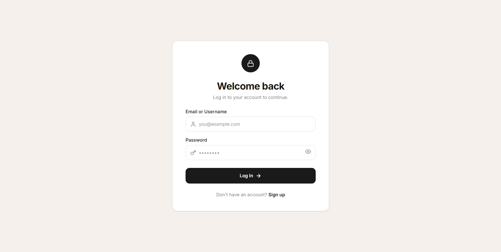
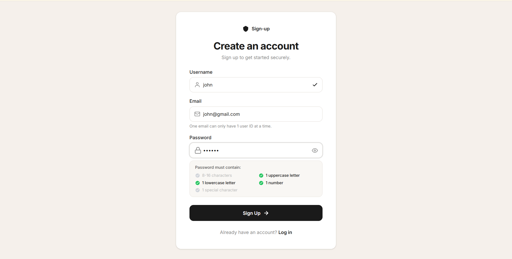
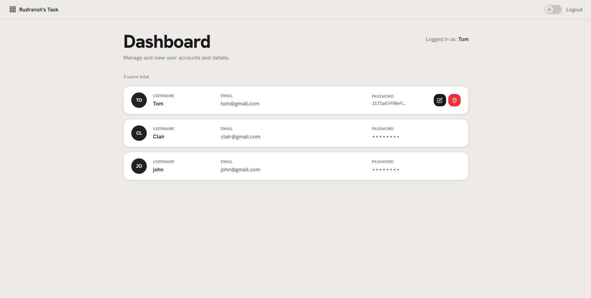
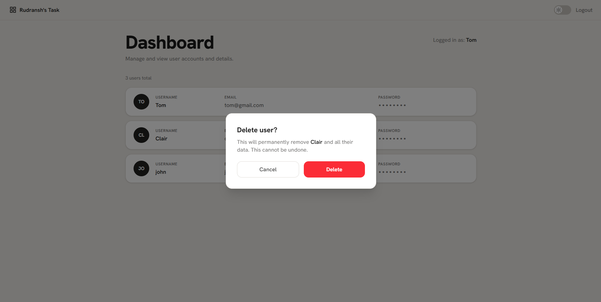
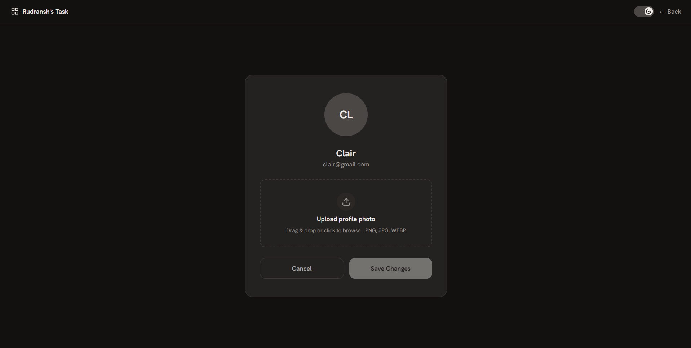
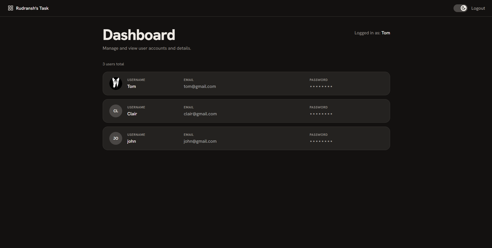
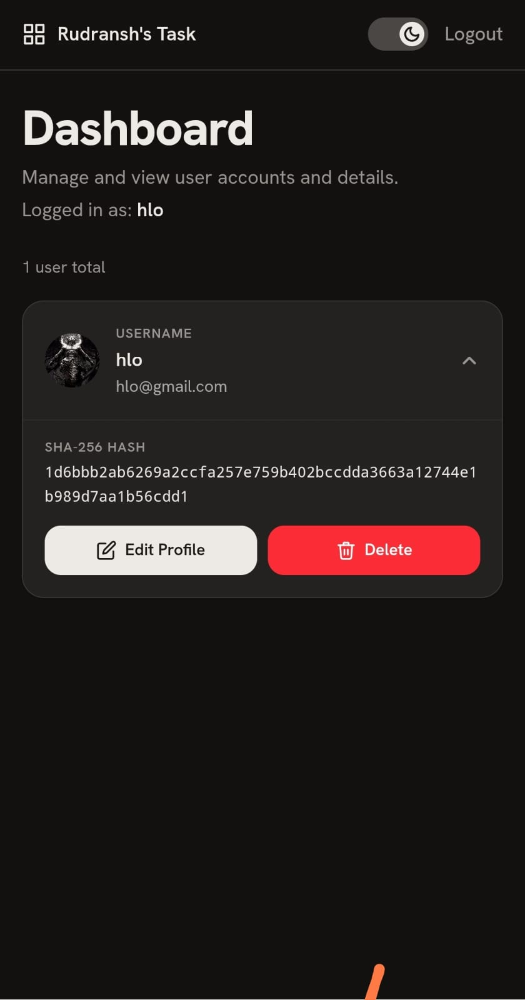

# Auth Dashboard Task

A signup/login web app with a user dashboard, built for the Newton School Coding Club × SRM IST technical recruitment task.

**Live demo:** [auth-dashboard-task-eight.vercel.app](https://auth-dashboard-task-eight.vercel.app)

## Overview

Users can sign up, log in, and view/manage a table of registered accounts on a dashboard. All data is stored client-side in the browser's `localStorage` — there is no backend or database.

## Features Implemented

### Core task
- **Signup form** with three fields:
  - Username — required, 3–16 characters, letters/numbers/`_`/`-` only, must be unique
  - Email — validated with a regex, must be unique per account
  - Password — required to be 8–16 characters with at least one uppercase letter, one lowercase letter, one number, and one special character (live checklist shown while typing)
- Inline validation errors shown per field before submission is allowed
- On successful signup, the password is **salted and hashed** (see [Security notes](#security-notes) below) and the record is saved to `localStorage`
- **Dashboard** listing all registered users in a table-style layout (Username, Email, and a masked/revealable password hash — see note below on why this differs from the original spec)
- **Login page** — a separate flow (not in the original task) that checks username/email + password against stored records before granting access to the dashboard

### Brownie subtasks
- ✅ **Delete button** — each user row has a delete action with a confirmation modal before removing the record
- ✅ **Dark/Light mode toggle** — persisted in `localStorage` (`rt_dark_mode`) so the theme survives page refreshes

### Extra features beyond the brief
- Profile photo upload per user (drag-and-drop or file picker, stored as base64 in `localStorage`)
- Show/hide password toggle on login and signup
- Responsive layout — compact expandable cards on mobile, full table-style rows on desktop
- Backward-compatible login path for any legacy account that might have plaintext `password` instead of a hash (defensive code, not something the app currently produces)

## Security Notes

**Read this before assuming the password handling is production-grade — it isn't, by design of the exercise.**

Passwords are hashed client-side using the browser's built-in `crypto.subtle.digest("SHA-256", ...)`, combined with a random 16-byte salt generated per user (`crypto.getRandomValues`). The salt and resulting hash are both stored in `localStorage`.

This satisfies the task's literal instruction to "hash the password before storing," but it is **not secure** for a real application:
- Everything happens in the browser — anyone with dev tools can read `localStorage` directly and see the hash + salt.
- SHA-256 is fast, which makes it practical to brute-force offline once you have the hash and salt.
- There is no server, so there's no way to rate-limit login attempts or keep secrets away from the client.
- A real implementation would hash passwords **server-side** with a slow, purpose-built algorithm (bcrypt, scrypt, or Argon2), and the client would never see the hash at all.

Because of this, the dashboard also deliberately does **not** display plaintext passwords in the table, even though the original task lists "Password" as a column — it shows the hash, masked by default and revealed on hover/tap.

## Tech Stack

- **React 19** + **TypeScript**
- **Vite 8** (dev server / bundler)
- **Tailwind CSS 4**
- **pnpm** as package manager
- No backend — all persistence is `localStorage`
- Scaffolded with the help of Figma's AI "Make" tool, then modified and understood section by section

## Project Structure

```
├── src/
│   └── App.tsx        # entire app: types, storage helpers, hashing, validation,
│                       # all pages (Login, Signup, Dashboard, Edit Profile), root component
├── public/
├── index.html
├── vite.config.ts
├── tsconfig.json
├── package.json
└── pnpm-lock.yaml
```

The whole app currently lives in a single `App.tsx` file with page components defined inline (`LoginPage`, `SignupPage`, `DashboardPage`, `EditProfilePage`) plus shared UI pieces (icons, `FormInput`, `Avatar`, `UserCard`, `ConfirmModal`, `DarkToggle`).

## Getting Started

Requires [pnpm](https://pnpm.io/installation).

```bash
# install dependencies
pnpm install

# start the dev server
pnpm dev

# build for production
pnpm build

# preview the production build locally
pnpm preview
```

## How Data Is Stored

All data lives in the browser's `localStorage` under these keys:
| Key | Purpose |
|---|---|
| `rt_users` | Array of all registered users (username, email, password hash + salt, optional profile picture) |
| `rt_current_user` | Username of whoever is currently logged in |
| `rt_dark_mode` | `"1"` or `"0"` — persisted theme preference |

This means data is per-browser, per-device — clearing browser storage or switching browsers loses all accounts.

## Validation Rules

| Field | Rule |
|---|---|
| Username | 3–16 characters, letters/numbers/`_`/`-` only, must be unique (case-insensitive) |
| Email | Must match standard email format, must be unique |
| Password | 8–16 characters, at least 1 uppercase, 1 lowercase, 1 number, 1 special character |

## What I Learned

This was my first time building anything like a real website — I had no prior real experience with HTML, CSS, TypeScript, or React going in, and picked most of it up by tracing through this specific codebase rather than learning it abstractly first. A few things that actually became clear while working through it:

**localStorage vs. a real backend.** In this app, data is stored in the browser's `localStorage`, which is separate per browser/origin on each device — not shared across devices or even across different browsers on the same device. That's why two people (or the same person on two devices) can't see the same list of signed-up users here. A real server stores account data in one central place, so anyone with the right credentials can reach it regardless of which device or browser they're on. This is the core reason this app can't have "real" multi-device accounts without a backend.

**Conditional rendering vs. routing.** My app switches between Login, Signup, and Dashboard using React state (`useState<Page>`) — the whole page is just "hidden" and another one is rendered in its place, but the URL never changes. Actual routing (e.g. React Router) instead changes the URL itself when moving between views. Because my app never changes the URL, there's no way to bookmark a specific screen or expect the back button to move between the app's own pages — hitting back takes you out of the app entirely to whatever was open before it, since there's no browser history entry between "login" and "dashboard" to go back through.

**Why the password salt is random per user, not shared globally.** If every user shared one salt, two people with the same password would end up with the identical password hash. That's a real problem even without cracking anything: anyone with read access to the stored data (trivial here, since it's plaintext-visible in devtools) could immediately tell which accounts share a password just by comparing hashes. Worse, if an attacker cracks one shared-salt hash — for example using a rainbow table (a precomputed table mapping common passwords to their hashes) — that same password is now known for every other account using that salt. Generating a random salt per user means identical passwords produce completely different hashes, so cracking one account leaks nothing about any other, and precomputed rainbow tables stop being useful since they'd need to be rebuilt per salt.

**`async`/`await` in `hashPassword`.** This one didn't click immediately. `crypto.subtle.digest`(...), which actually computes the hash, doesn't return the hashed bytes right away — it returns a `Promise`, a placeholder for a value that isn't ready yet, because hashing takes a small but non-zero amount of time and JavaScript doesn't want to freeze the page while it waits. `async function hashPassword(...)` marks the function as allowed to pause internally, and `await` is the actual "wait for this to finish" instruction — it pauses just that function (not the whole app) until the Promise resolves, then hands back the real value. Any function that calls an `await`-ing function has to itself be `async` and `await` it too, which is why `handleSignup` is also `async` — it chains upward from wherever the actual waiting happens.

## Screenshots

**Login**


**Sign up — live password validation**


**Dashboard (light mode)** — password hash revealed on hover


**Delete confirmation modal**


**Edit profile (dark mode)**


**Dashboard (dark mode)**


**Mobile view (dark mode, expanded card)**


## Deployment

Deployed on [Vercel](https://vercel.com), connected directly to this GitHub repository via Vercel's dashboard (Import Project), so every push to `main` triggers an automatic production deploy.

- **Framework Preset:** Vite (auto-detected by Vercel — not set manually)
- **Build Command:** `vite build` (default)
- **Output Directory:** `dist` (default)
- **Install Command:** default (pnpm/npm auto-detected)
- **Environment variables:** none (confirmed empty in Vercel project settings)

**Live link:** [auth-dashboard-task-eight.vercel.app](https://auth-dashboard-task-eight.vercel.app)

To deploy your own copy:
1. Push this repo to your own GitHub account
2. Go to [vercel.com/new](https://vercel.com/new) and import the repository
3. Leave all framework/build settings on their auto-detected defaults
4. Deploy — no environment variables need to be added

## Known Limitations

- No real backend — anyone with access to the browser's dev tools can view/edit stored data directly
- Password hashing is client-side only and not suitable for a real production app (see [Security Notes](#security-notes))
- Data does not sync across browsers or devices
